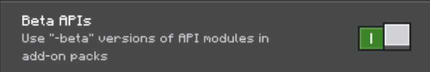
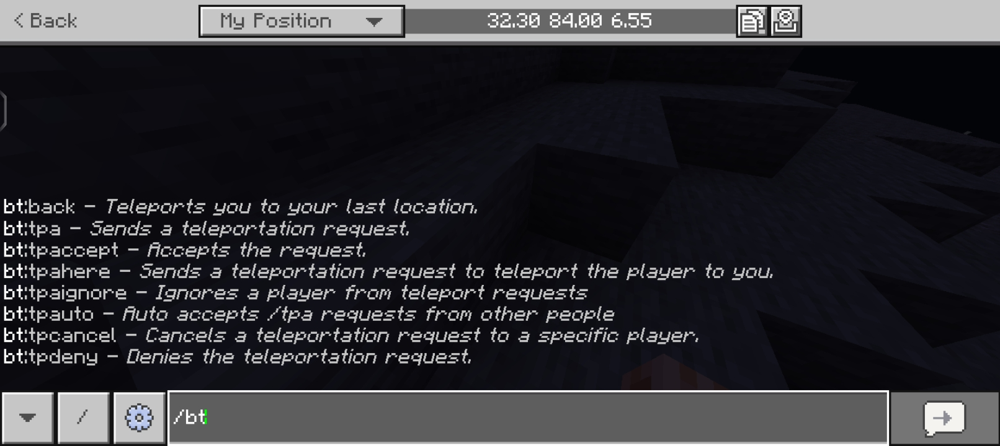

# Bedrock-TPA

An Minecraft: Bedrock Edition add-on inspired by [Simple-TPA](https://www.spigotmc.org/resources/simple-tpa.64270/). Allowing players to teleport to another players providing better interaction between another.

## Documentation
- [Commands List](https://github.com/IndeedItzGab/Bedrock-TPA/blob/main/docs/COMMANDS.md#available-commands)
- [FAQ](https://github.com/IndeedItzGab/Bedrock-TPA/blob/main/docs/FAQ.md#frequently-asked-questions)
- [Installation Guide](https://github.com/IndeedItzGab/Bedrock-TPA/blob/main/docs/INSTRUCTIONS.md#instructions)

## Requirements
- Beta APIs enabled in experimental features section.

## Installation
Visit [here](docs/INSTRUCTIONS.md) for more information about installing this project.

## Features
- Allows you to teleport to a certain players with if that player accepted your teleportation request.
- You can teleport back to your recent location when you died or recently teleported to a certain player.
- You can automatically accept all teleportation request with one command.
- You can request a player to teleport to you.
- Custom Slash Commands. See [commands list](docs/COMMANDS.md)

## Contributions
- **Reporting Bugs** - If you encounter any bugs while using BedrockTPA, please open an [issue](https://github.com/IndeedItzGab/Bedrock-TPA/issues/new) in our github repository. Ensure to include a detailed description of the issue and steps to reproduce it.
- **Submitting a Pull Request** -We appreciate code contribution for this project. Especially if you have fixed a bug or implemented a new feature, you may submit a pull request.

Please ensure your code follows our coding standard and includes tests where possible.

## Copyright
© 2025 IndeedItzGab. All rights reserved.
- You may not distribute this project without explicit permission and proper credit.
- You may modify this project for **personal use only**.

## Social
- [Discord](https://discord.gg/4TceQdswpW)
- [Twitter/X](https://x.com/IndeedItzGab?t=mVb6cc54QfokUthzfjZrXQ&s=09)
- [Tiktok](https://www.tiktok.com/@indeeditzgab?_t=ZS-8wILO97Irf6&_r=1)
- [Youtube](https://youtube.com/@indeeditzgab?si=aTD1oMnwc6g6NS9L)
- [GitHub](https://github.com/IndeedItzGab)

## Support Me
- [PayPal](https://www.paypal.me/GabrielBondoc09)
